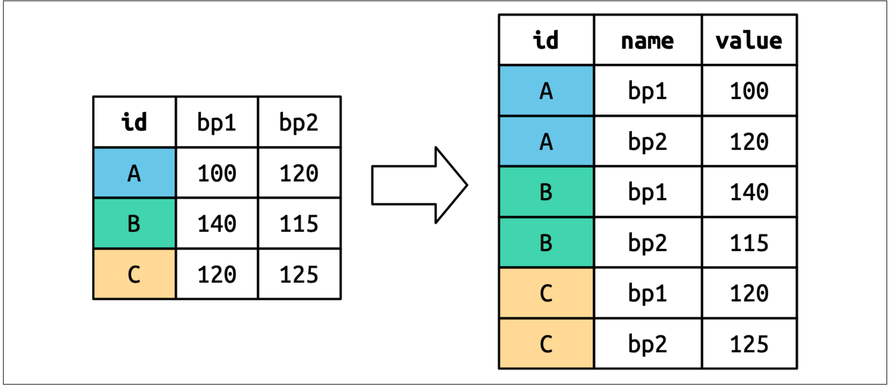
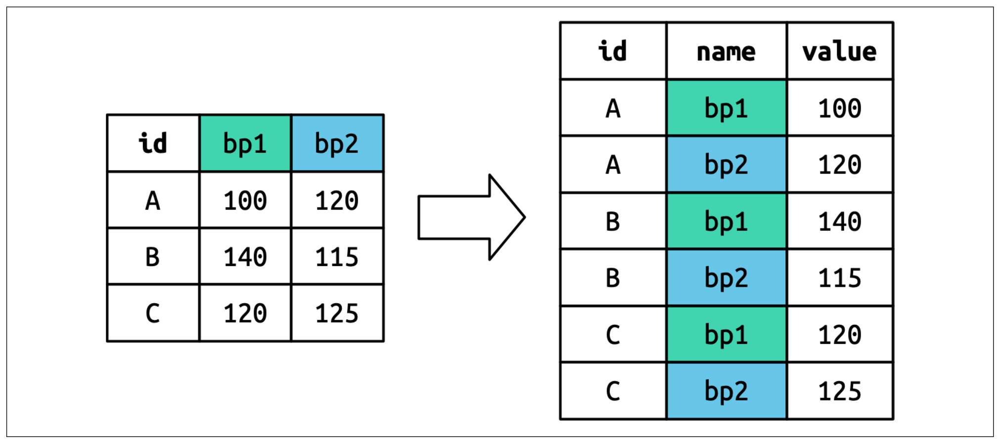
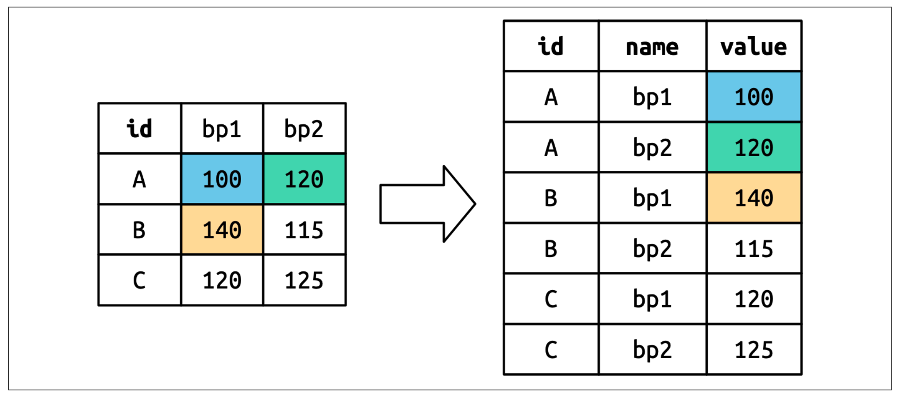
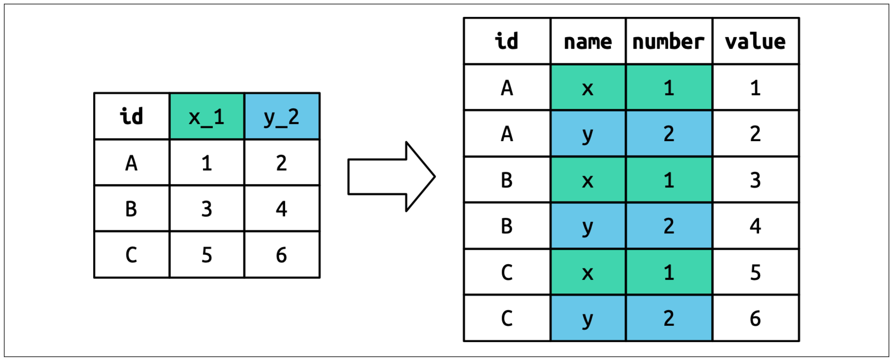
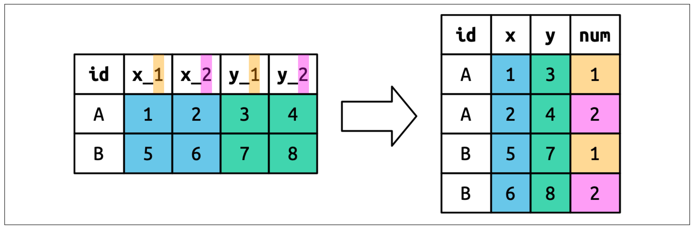

 

```{r echo=FALSE}
knitr::opts_chunk$set(out.width="90%",out.height="90%") 
setwd("~/Documents/Cursos/VisualizacionConR")
library(reshape)
library(ggplot2)
```

# Transformación de datos

## 

Todos los conjuntos de datos ordenados son iguales, pero cada conjunto de datos desordenado es desordenado a su manera.

## Introducción

-   Aprenderá una forma consistente de organizar datos en R utilizando un sistema llamado `tidy data`.

-   Poner los datos en este formato requiere algo de trabajo al principio, pero ese trabajo dará sus frutos a largo plazo.

-   Una vez que tenga datos organizados y las herramientas proporcionadas por los paquetes en `tidyverse`, dedicará mucho menos tiempo pasando los datos de una representación a otra, lo que le permitirá dedicar más tiempo a las preguntas que le interesan sobre los datos.


## Introducción (cont)

-   Aprenderemos la definición de `tidy data` y la aplicaremos a un conjunto de datos de *juguete* simple.


-   Estudiaremos la herramienta principal que utilizarás para organizar los datos: `pivoting`.

-   El `pivoting` permite cambiar la forma de los datos sin cambiar ninguno de los valores.

# Datos estructurados (`tidy data`)

## Tidy Data

-   Se pueden representar los mismos datos de varias maneras.

-   El siguiente ejemplo muestra los mismos datos organizados de tres maneras diferentes.

-   Cada conjunto de datos muestra los mismos valores de cuatro variables: país (`country`), año (`year`), población (`population`) y número de casos (`cases`), documentados de tuberculosis (TB),

-   Pero cada conjunto de datos organiza (estructura) los valores de manera diferente.

## Tidy Data (tabla 1)

```{r}
#| echo: TRUE
#| output-location: fragment
#| column: screen-inset-shaded 

library(tidyverse) 
table1
```

## Tidy Data (tabla 2)

```{r}
#| echo: TRUE
#| output-location: fragment
#| column: screen-inset-shaded 
#| 
table2
```

## Tidy Data (tabla 3)

```{r}
#| echo: TRUE
#| output-location: fragment
#| column: screen-inset-shaded 
#| 
table3
```

-   Todas ellas son representaciones de los mismos datos, pero no son igualmente fáciles de usar. Una de ellas, la tabla 1, será mucho más fácil de usar dentro de `tidyverse` porque es `tidy` (organizada).

## Reglas para que un data sea `tidy` (organizado, estructurado)

Hay tres reglas interrelacionadas que hacen que un conjunto de datos esté organizado (estructurado):

- Cada variable es una columna; Cada columna es una variable.
- Cada observación es una fila; Cada fila es una observación.
- Cada valor es una celda; Cada celda es un valor único.

## Ventajas de que los datos sean `tidy`

-   ¿Por qué asegurarse de que sus datos estén organizados? Hay dos ventajas principales:

    -   Existe una ventaja general en elegir una forma consistente de almacenar datos. Si tienes una estructura de datos consistente, es más fácil aprender las herramientas que trabajan con ella porque tienen una uniformidad subyacente.
    
    
## Ventajas de que los datos sean `tidy` 

- Hay una ventaja específica en colocar variables en columnas porque permite que la naturaleza vectorizada de R brille. Como vimos con `mutate()` y `summarize()`, la mayoría de las funciones integradas de R trabajan con vectores de valores. Esto hace que la transformación de datos organizados resulte especialmente natural.

-   `dplyr`, `ggplot2` y todos los demás paquetes de `tidyverse` están diseñados para trabajar con `tidy data` (datos estucturados).

-   A continuación se muestran algunos ejemplos de cómo trabajar con la tabla 1:

## Tasa por cada 10k habitantes

```{r} 
#| echo: true
#| output-location: fragment
#| column: screen-inset-shaded 

table1 |> mutate(rate = cases / population * 10000)
```

## Total de casos por año

```{r}
#| echo: true
#| eval: false
#| output-location: fragment
#| column: screen-inset-shaded 

table1 |> group_by(year) |> 
  summarize(total_cases = sum(cases))
```

```{r}
#| echo: false 
#| output-location: fragment
#| column: screen-inset-shaded 
table1 |> group_by(year) |> summarize(total_cases = sum(cases))
```

## Visualizar cambios en el tiempo

```{r echo=TRUE , eval=FALSE}
ggplot(table1, aes(x = year, y = cases)) +
geom_line(aes(group = country), color = "grey50") +
geom_point(aes(color = country, shape = country)) +
scale_x_continuous(breaks = c(1999, 2000))
```

## Visualizar cambios en el tiempo

```{r }
#| echo: false
#| eval: true
#| output-location: fragment
#| column: screen-inset-shaded 

ggplot(table1, aes(x = year, y = cases)) +
geom_line(aes(group = country), color = "grey50") +
geom_point(aes(color = country, shape = country)) +
scale_x_continuous(breaks = c(1999, 2000))
```

## Ejercicios

-   Para cada una de las tablas anteriores, describa qué representa cada observación y cada columna.

-   Describe el proceso que usarías para calcular la tasa de las tablas 2 y 3. Deberás realizar cuatro operaciones:

    1.  Extraer el número de casos de tuberculosis por país al año.
    2.  Extraer la población coincidente por país al año.
    3.  Dividir los casos entre la población y multiplicar por 10000.
    4.  Guardar en el lugar correspondiente.

# Alargamiento de datos: (`pivot_longer`)

## Alargamiento de datos

Los principios de los datos estructurados pueden parecer tan obvios que uno se pregunta si alguna vez encontrará un conjunto de datos que no lo esté.

:::callout-note
Sin embargo, lamentablemente, la mayoría de los datos reales son no estructurados.
::: 


## Datos no estructurados: razones

Hay dos razones principales:

- Los datos suelen organizarse para facilitar algún objetivo distinto al análisis. Por ejemplo, es común estructurarlos para facilitar la entrada de datos, no el análisis.

- La mayoría de las personas no están familiarizadas con los principios de los datos organizados, y es difícil obtenerlos uno mismo a menos que se dedique mucho tiempo a trabajar con ellos.

## Datos no estructurados: razones 

-   Esto significa que la mayoría de los análisis reales requieren al menos un poco de ordenamiento.

-   Comenzarás por determinar cuáles son las variables y observaciones subyacentes.

-   A veces es fácil; otras veces, tendrás que consultar con quienes generaron los datos originalmente.

-   A continuación, organizaremos datos para obtener un formato organizado, con las variables en las columnas y las observaciones en las filas.

## Pivoteo de datos

-   `tidyr` ofrece dos funciones para pivotar datos: `pivot_longer()` y `pivot_wider()`.

-   Empezaremos con `pivot_longer()`, ya que es el caso más común

Usaremos el data `billboard` que registra el ranking Billboard de las canciones en el año 2000:

```{r}
#| output-location: fragment
#| column: screen-inset-shaded 
billboard
```

## El data `billboard`

-   En este conjunto de datos, cada observación corresponde a una canción.

-   Las tres primeras columnas (artista, canción y fecha de entrada) son variables que describen la canción.

-   A continuación, tenemos 76 columnas, `wk1` a `wk76`, (semanas 1 a 76) que describen la posición de la canción en cada semana.

-   Aquí, los nombres de las columnas representan una variable (la semana) y los valores de las celdas representan otra variable (la posición).

## El data `billboard`,  `pivot_longer()` 

-   Para organizar estos datos, usaremos `pivot_longer()`


```{r}
#| echo: true
#| eval: false
#| output-location: fragment
#| column: screen-inset-shaded 
billboard |> pivot_longer( 
  cols = starts_with("wk"), 
  names_to = "week",
  values_to = "rank" )
```


```{r}
#| echo: false
#| eval: true
#| output-location: fragment
#| column: screen-inset-shaded


billboard |> pivot_longer( cols = starts_with("wk"), names_to = "week", values_to = "rank"
)
```

## 

```{r}
#| echo: true
#| output-location: fragment
#| column: screen-inset-shaded


billboard |> pivot_longer( cols = starts_with("wk"), names_to = "week", values_to = "rank"
)
```

## Explicación

Después de los datos, hay tres argumentos clave:

-   Especifica qué columnas deben *pivotarse* (es decir, qué columnas no son variables).

    -   Este argumento usa la misma sintaxis que `select()`, por lo que aquí podríamos usar `!c(artist, track, date.entered)` o `starts_with("wk")`

-   `names_to`: especifica el nombre de la columna donde se guardarán los nombres de las semanas

-   `values_to`: especifica el nombre de la columna donde se guardarán los valores de las celdas

## Explicación II 

-   Tenga en cuenta que en el código `week` y `rank` están entre comillas porque son variables nuevas que estamos creando; aún no existen en los datos cuando ejecutamos la llamada `pivot_longer()`.

## Porqué los NA ?

```{r echo=FALSE}
billboard |> pivot_longer( cols = starts_with("wk"), names_to = "week", values_to = "rank"
)
```

## Porqué los NA ?

Ahora, centrémonos en el marco de datos resultante.

-   ¿Qué ocurre si una canción permanece en el top 100 durante menos de 76 semanas?

-   Ejemplo: "Baby Don't Cry" de *2 Pac*. El resultado anterior sugiere que solo estuvo entre las 100 primeras durante 7 semanas

-   Las semanas restantes se completan con valores faltantes.

-   Estos `NA` en realidad no representan observaciones flatantes; la estructura del conjunto de datos las obligó a existir

## Uso de `values_drop_na= TRUE`


-   Podemos pedirle a `pivot_longer()` que se deshaga de ellas con la opción `values_drop_na= TRUE`


```{r echo=TRUE, eval=FALSE}
billboard |> pivot_longer(cols=
                starts_with("wk"),
                names_to = "week",
                values_to = "rank",
                values_drop_na= TRUE )
```

## Sin faltantes

```{r echo=FALSE}
billboard |> pivot_longer( cols = starts_with("wk"), names_to = "week", values_to = "rank", values_drop_na= TRUE )
```

## Convertir `week` a numérica

-   Estos datos ahora están estructurados (son `tidy`),

-   Podríamos hacer que los cálculos futuros sean un poco más fáciles convirtiendo los valores de la semana de cadenas de caracteres a números.

-   usando `mutate()` y `parse_number()`

    -   `parse_number()` extrae el primer número de una cadena, ignorando todo el resto del texto.

## `parse_number()`

```{r echo=TRUE}
billboard_l<- billboard |> 
  pivot_longer( cols = starts_with("wk"),
                names_to = "week",
                values_to = "rank",
                values_drop_na =TRUE ) |>     
                mutate(week = 
                parse_number(week))
billboard_l
```

## Ejercicio

-   Use `pivot_longer()` para llevar los datos de la `tabla1` a la forma de la `tabla2`

-   Con los datos de acuicultura

```{r echo=TRUE}
acuicultura=read.csv2('./data/acuicultura.csv') 
head(acuicultura) 
```

## Ejercicio usar `pivot_longer()`

-   Organizar los datos de tal forma que `OXIGESUP` `OXIGEFON` queden en una sola columna como se muestra a continuación.   <!-- - Primero seleccionamos las columnas que usaremos 
                  - Luego usamos `pivot_longer()` -->

```{r echo=FALSE,eval=TRUE}
oxigeno<-acuicultura |> select(PISCINA:OXIGEFON) |> pivot_longer( cols = starts_with("OXIGE"), names_to = "Sitio", values_to = "Oxigeno" )
oxigeno
```

## Solución

```{r echo=TRUE,eval=FALSE}
oxigeno<-acuicultura |> 
  select(PISCINA:OXIGEFON) |> pivot_longer( cols=
        starts_with("OXIGE"), names_to = "Sitio",
        values_to = "Oxigeno" )
oxigeno
```


## Visualización de los datos de billboard

-   Ahora que tenemos todos los números de semana en una variable y todos los valores de clasificación en otra, podemos visualizar cómo varían las clasificaciones de las canciones con el tiempo.

```{r echo=TRUE,eval=FALSE}
billboard_l |>
ggplot(aes(x = week, y = rank, group = track)) +
geom_line(alpha = 0.25) +
scale_y_reverse()
```

## Visualización de los datos de billboard

```{r echo=FALSE,eval=TRUE}
billboard_l|>
ggplot(aes(x = week, y = rank, group = track)) +
geom_line(alpha = 0.25) +
scale_y_reverse()
```

## Visualización de los datos de billboard

Podemos observar que muy pocas canciones permanecen en el top 100 durante más de 20 semanas.

## ¿Cómo funciona el pivoteo?

-   Ahora que hemos visto cómo usar la pivotación para reorganizar los datos, dediquemos un tiempo a comprender mejor su efecto.

-   Usaremos un conjunto de datos simple para que sea más fácil ver qué sucede.

-   Supongamos que tenemos tres pacientes con identificadores `A`, `B` y `C`, y tomamos dos medidas de presión arterial a cada uno.

-   Crearemos el data con `tribble()`, una función práctica para construir pequeños `tibbles` manualmente.

## Data de juguete

```{r echo=TRUE,eval=TRUE}
df <- tribble(
~id,~bp1,~bp2,
"A", 100, 120,
"B", 140, 115,
"C", 120, 125
)
df
```

## Pivotear `df`

-   Queremos que nuestro nuevo conjunto de datos tenga tres variables:
    -   `id` (ya existente),
    -   `medición` (los nombres de las columnas) y
    -   `valor` (los valores de las celdas).
-   Para lograrlo, necesitamos pivotar `df` para ponerlo en formato "largo"

## Pivotear `df`

```{r echo=TRUE,eval=TRUE}
df_l=df |> pivot_longer(cols = bp1:bp2,
names_to = "measurement",
values_to = "value" )
```

## Cómo trabaja?

-   Los valores de la columna que ya era una variable en el conjunto de datos original (id) deben repetirse una vez por cada columna que se pivotea.



## Cómo trabaja?

-   Los nombres de las columnas se convierten en valores de una nueva variable, cuyo nombre se define mediante `names_to`. Deben repetirse una vez para cada fila del conjunto de datos original.



## Cómo trabaja?

-   Los valores de celda también se convierten en valores de una nueva variable, cuyo nombre se define como `values_to`. Ellas se desenrollan fila por fila.



## Muchas variables en los nombres de columnas

-   Una situación más compleja se presenta cuando se tienen múltiples datos agrupados en los nombres de las columnas y se desea almacenarlos en nuevas variables independientes.

-   Por ejemplo, tomemos el conjunto de datos `who2`, la fuente de las tablas 1 2 y 3 anteriores.

```{r echo=TRUE,eval=TRUE}
who2
```

## who2

-   Este conjunto de datos, recopilado por la Organización Mundial de la Salud, registra información sobre los diagnósticos de tuberculosis.

-   Hay dos columnas que ya son variables y son fáciles de interpretar: `country` y `year`.

-   Les siguen 56 columnas como `sp_m_014`, `ep_m_4554` y `rel_m_3544`.

-   Si miras estas columnas cuidadosamente, notarás que hay un patrón.

-   El nombre de cada columna se compone de tres partes separadas por `_`.


## who2 (II) 

- La primera parte, `sp/rel/ep`, describe el método utilizado para el diagnóstico;
- La segunda parte, `m/f`, es el género
- La tercera parte, 014/1524/2534/3544/4554/65, es el rango de edad (014 representa de 0 a 14, por ejemplo).

## who2 (III) 

-   Tenemos seis datos registrados en who2:

    -   El país y el año (ya en columnas);
    -   El método de diagnóstico,
    -   La categoría de género y
    -   La categoría de rango de edad
    -   El número de pacientes en esa categoría (valores de celda).
    
    
## who2 (IV) 

-   Para organizar estos seis datos en seis columnas separadas, usamos `pivot_longer()` con un vector de nombres de columna para `names_to`

-   Instrucciones para dividir los nombres de las variables originales en fragmentos para `names_sep`,

-   Así como un nombre de columna para `values_to`

## who2

```{r echo=TRUE,eval=TRUE}
who2|>pivot_longer(
cols = !(country:year),
names_to = c("diagnosis", "gender", "age"),
names_sep = "_",
values_to = "count"
)
```

## Cómo funciona?

Ahora, en lugar de pivotar los nombres de las columnas en una sola, pivotan en varias. Puedes imaginar que esto sucede en dos pasos: primero pivotando y luego separando.



## Nombres de datos y variables en los encabezados de columna

El siguiente nivel de complejidad se da cuando los nombres de las columnas incluyen una combinación de valores y nombres de variables. Por ejemplo, tomemos el conjunto de datos `household`

```{r echo=TRUE,eval=TRUE}
household
```

## `household`

-   Este conjunto de datos contiene datos sobre cinco familias, con los nombres y fechas de nacimiento de hasta dos hijos.

-   El reto radica en que los nombres de las columnas contienen los nombres de dos variables (fecha de nacimiento, nombre) y los valores de otra (hijo, con valores 1 o 2).

-   Para solucionar este problema, necesitamos proporcionar un vector a `names_to`, pero esta vez usamos el centinela especial ".value";

## 

-   Este no es el nombre de una variable, sino un valor único que indica a `pivot_longer()` que realice una acción diferente.

-   Esto anula el argumento habitual `values_to` para usar el primer componente del nombre de la columna pivotada como nombre de variable en la salida.

## Solución

```{r echo=TRUE,eval=TRUE}
household |>
  pivot_longer(
  cols = !family,
  names_to = c(".value", "child"),
  names_sep = "_",
  values_drop_na = TRUE
)
```

## Esquema



# Ampliación de datos: `pivot_wider()`

## `pivot_wider()`

-   A continuación, usaremos `pivot_wider()`, que amplía los conjuntos de datos aumentando las columnas y reduciendo las filas, y resulta útil cuando una observación se distribuye en varias filas.

-   Esto parece ser menos común en la práctica, pero sí se presenta con frecuencia al trabajar con datos gubernamentales.

## `pivot_wider()`

-   A continuación, usaremos `pivot_wider()`, para regresar los datos de oxigeno disuelto en la superficie y fondo a su estructura original, es decir, de

```{r echo=FALSE,eval=TRUE}
head(oxigeno,3)
```

a la forma

```{r echo=FALSE,eval=TRUE}
acuicultura|>select(PISCINA:OXIGEFON)
```

## `pivot_wider()`

```{r echo=TRUE,eval=TRUE}
oxigeno|>pivot_wider(
names_from = Sitio,
values_from = Oxigeno
)
```

## Ejemplo 2

Transformaremos los datos

```{r echo=FALSE,eval=TRUE}
df_l=df |> pivot_longer(cols = bp1:bp2,
names_to = "measurement",
values_to = "value" )
df_l
```

## Ejemplo 2

A su versión original

```{r echo=TRUE,eval=TRUE}
df
```

## Solución

```{r echo=TRUE,eval=TRUE}
df_l|>pivot_wider(
names_from = measurement,
values_from = value
)
```

## Otro ejemplo

-   Comenzaremos analizando `cms_patient_experience`, un conjunto de datos de los Centros de Servicios de `Medicare` y `Medicaid` que recopila datos sobre las experiencias de los pacientes:

## `cms_patient_experience` data

```{r echo=TRUE,eval=TRUE}
cms_patient_experience
```

## ¿Cómo están organizados los datos?

La unidad central estudiada es una organización, pero cada organización se distribuye en seis filas, con una fila por cada medición realizada en la organización de la encuesta. Podemos ver el conjunto completo de valores para `measure_cd` y `measure_title` usando `distinct()`:

```{r echo=TRUE,eval=TRUE}
cms_patient_experience |>
distinct(measure_cd, measure_title)
```

## 

-   Ninguna de estas columnas será un nombre de variable especialmente efectivo: `measure_cd` no indica el significado de la variable, y `measure_title` es una oración larga con espacios.

-   Por ahora, usaremos `measure_cd` como fuente para los nuevos nombres de columna, pero en un análisis real, podrías crear tus propios nombres de variable, que sean breves y con significado.

-   `pivot_wider()` tiene la interfaz opuesta a `pivot_longer()`: en lugar de elegir nuevos nombres de columnas, necesitamos proporcionar las columnas existentes que definen los valores `(values_from)` y el nombre de la columna `(names_from)`:

## `pivot_wider()`

```{r echo=TRUE,eval=TRUE}
cms_patient_experience |>
pivot_wider(
names_from = measure_cd,
values_from = prf_rate
)
```

## `pivot_wider()`

-   El resultado no es del todo correcto; parece que aún tenemos varias filas para cada organización.

-   Esto se debe a que también necesitamos indicar a `pivot_wider()` qué columna o columnas tienen valores que identifican de forma única cada fila; en este caso, son las variables que empiezan por "org":

```{r echo=TRUE,eval=FALSE}
cms_patient_experience |>
pivot_wider(
id_cols = starts_with("org"),
names_from = measure_cd,
values_from = prf_rate
) 
```

## `pivot_wider()`

```{r echo=FALSE,eval=TRUE}
cms_patient_experience |>
pivot_wider(
id_cols = starts_with("org"),
names_from = measure_cd,
values_from = prf_rate
) 
```

## Cómo trabaja `pivot_wider()`

-   Para entender cómo funciona `pivot_wider()`, usemos un conjunto de datos simple.

-   En esta ocasión tenemos dos pacientes con `ID` `A` y `B`;

-   Tenemos tres mediciones de presión arterial en el paciente `A` y dos en el paciente `B`:

```{r echo=TRUE,eval=TRUE}
df <- tribble( ~id, ~measurement,~value,
"A", "bp1", 100,
"B", "bp1", 140,
"B", "bp2", 115,
"A", "bp2", 120,
"A", "bp3", 105
) 
```

## Cómo trabaja `pivot_wider()`

```{r echo=TRUE,eval=TRUE}
df
```

## Cómo trabaja `pivot_wider()`

-   Tomaremos los valores de la columna `value` y los nombres de la columna `measurement`:

```{r echo=TRUE,eval=TRUE}
df|>pivot_wider(names_from = measurement,
values_from = value
)
```

-   Para comenzar el proceso, `pivot_wider()` primero debe determinar qué irá en las filas y columnas.

## Cómo trabaja `pivot_wider()`

-   Los nuevos nombres de columnas serán los valores únicos de `measurement`:

```{r echo=TRUE,eval=TRUE}
df |>
distinct(measurement) |>
pull() 
```

-   De forma predeterminada, las filas de la salida están determinadas por todas las variables que no entran en los nuevos nombres o valores.

-   Estos se llaman `id_cols`. En el ejemplo solo hay una columna, pero en general puede haber cualquier número.

## Cómo trabaja `pivot_wider()`

```{r echo=TRUE,eval=TRUE}
df |>select(-measurement,-value)|> distinct() 
```

## Cómo trabaja `pivot_wider()`

-   `pivot_wider()` luego combina estos resultados para generar un marco de datos vacío:

```{r echo=TRUE,eval=TRUE}
df |>select(-measurement, -value)|> 
    distinct()|>
    mutate(x = NA, y = NA, z = NA)
```

-   Luego, completa todos los valores faltantes utilizando los datos de entrada.

<!--En este caso, no todas las celdas de salida tienen un valor correspondiente en la entrada, ya que no hay una tercera medición de presión arterial para el paciente B, por lo que esa celda sigue faltando.-->

## Cómo trabaja `pivot_wider()`

-   Qué sucede si hay varias filas en la entrada que corresponden a una celda en la salida.

-   El siguiente ejemplo tiene dos filas que corresponden al id A y la medición bp1:

```{r echo=TRUE,eval=TRUE}
df <- tribble(
~id,
~measurement,
~value,
"A", "bp1", 100,
"A", "bp1", 102,
"A", "bp2", 120,
"B", "bp1", 140,
"B", "bp2", 115
)

```

## Cómo trabaja `pivot_wider()`

Si intentamos pivotar este data, obtenemos una salida que contiene columnas de lista. Sobre lo que aprenderemos más adelante.

```{r echo=TRUE,eval=TRUE}
df|>pivot_wider(names_from = measurement,
values_from = value
)
```
